# Estacionamiento con Arduino
Fecha de entrega: 22/05/20  
Elaborado por: García Ruiz Andrea  

### Objetivo
- Aplicar los conocimientos adquiridos en el curso de microcomputadoras para el desarrollo de un sistema basado en microcontrolador que incluya: un sensor de entrada, un sistema controlador con conexión hacia un celular y un actuador.

### Análisis del problema
A continuación se muestran las conexiones del sistema propuesto:

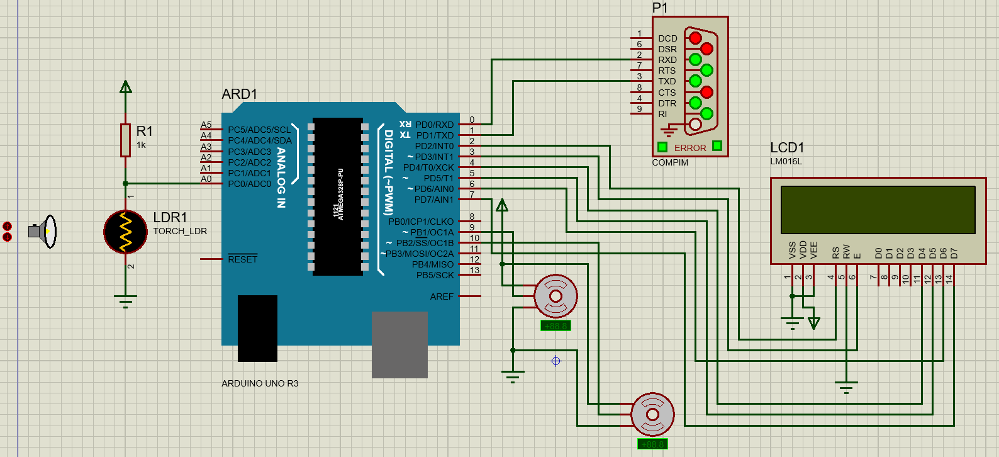

En nuestro sistema tenemos 2 situaciones principales: la entrada y la salida de un auto.

Cuando un auto desea ingresar al estacionamiento, su presencia es detectada por el sensor. Si se tienen vacantes disponibles se levantará la pluma y se permitirá el acceso. La descripción más detallada de cómo se comporta el sistema para la entrada de automóviles se ilustra en el siguiente diagrama de flujo:  

  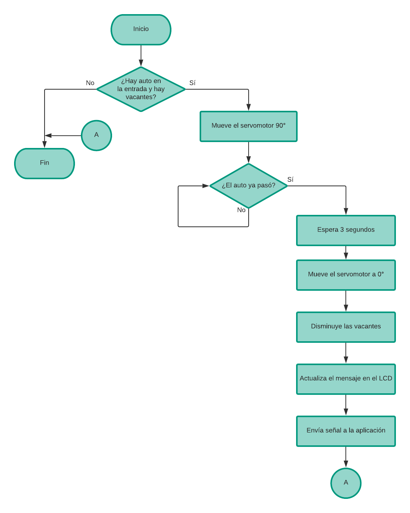

Para la salida de automóviles, se recibe un dato proveniente de una aplicación Android que puede ser 1 o 0. Depeniendo del dato adquirido se levantará o bajará la pluma del estacionamiento, este proceso se ilustra a continuación:

  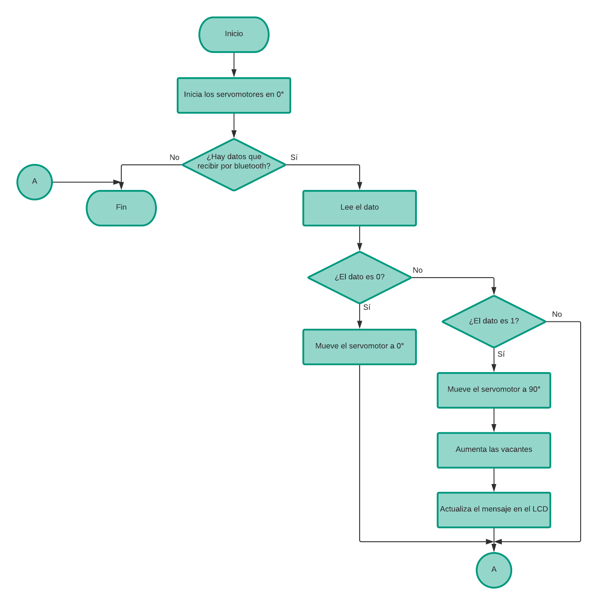

Adicional a las 2 situaciones anteriores, el sistema requiere de una inicialización ya que se necesita obtener el dato de las vacantes totales, que es enviado desde la aplicación Android además de realizar otras acciones. El diagrama de flujo correspondiente es el siguiente:

  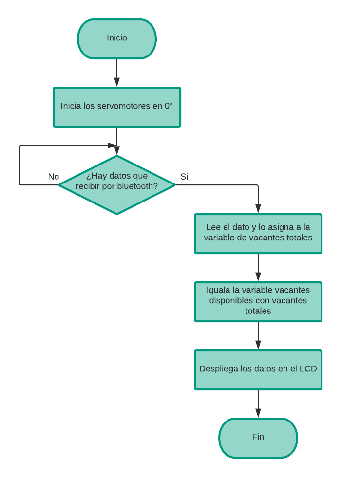

### Codificación

#### LCD
Para el uso del LCD se utilizó la librería que provee Arduino, la cual puede importarse de la siguiente manera:

~~~
#include <LiquidCrystal.h>
~~~

Con el fin de escribir mensajes en el LCD, el primer paso es definir una variable de tipo LiquidCrystal e indicar los pines que se están usando para RS, E, D4, D5, D6 y D7. Lo anterior se le pasará como parámetro en ese orden.

~~~
LiquidCrystal lcd = LiquidCrystal(2, 3, 4, 5, 6, 7);
~~~  

Una vez que se realiza lo anterior, en la función setup se debe inicializar el LCD indicando la cantidad de renglones y columnas que tiene. Por ejemplo la siguiente línea indica que se está usando un LCD de 16 columnas y 2 renglones.

~~~
lcd.begin(16, 2);
~~~  

Ya que se realizaron las configuraciones iniciales,es posible trabajar con el LCD a través de funciones como
print, setCursor y clear.

Para el proyecto se generó una función llamada desplegar_vacantes, que escribe en la segunda línea del LCD las vacantes disponibles y se utiliza cada que hay una actualización.

~~~
void desplegar_vacantes(){
      String v2 = "Disponibles:";
      v2.concat(vacantes_disp);
      lcd.setCursor(0,1);
      lcd.print(v2);
}
~~~  

Las vacantes totales también se escriben en la pantalla LCD, pero esta acción se realiza después de adquirir el dato por bluetooth en la función iniciar.

~~~
void iniciar(){

      //Leer dato del puerto serie y guardarlo en vacantes_tot
      v1.concat(vacantes_tot);    
      lcd.setCursor(0, 0);  
      lcd.print(v1);  
      desplegar_vacantes();  

}
~~~

#### Servomotor
Arduino posee también una librería para trabajar con servomotores, que se importa con la siguiente línea:

~~~
#include <Servo.h>
~~~

El uso es sencillo,únicamente se debe definir la variable de tipo Servo y posteriormente en la función setup indicar el pin en el que está conectado.

Para el proyecto se utilizaron 2 servomotores que se conectaron al pin 9 y 10 respectivamente, la definición se realiza de la siguiente forma:

~~~
Servo servomotor1,servomotor2;
void setup() {

      //Otras configuraciones
      servomotor1.attach(9);                               
      servomotor2.attach(10);                               

}
~~~

Finalmente para mover los servomotores se utiliza la función write, en donde el parámetro que recibe es el ángulo al que se moverá el servo. En el proyecto se utiliza constatemente esta función para el movimiento de la pluma.

Internamente lo que realiza la función write, consiste en generar una señal PWM con un pulso de trabajo entre 1 ms y 2 ms. Dependiendo del valor se determina el giro del servomotor, es importante mencionar que el periodo de la señal es de 20 ms lo que indicará la velocidad del servomotor.   

#### Bluetooth

A través del bluetooth es posible la comunicación con otros dispositivos, para el proyecto se realizó una conexión con un celular Android.

La recepción y transmisión de datos hacen uso del puerto serial, por lo que el primer paso a realizar es iniciar e indicar la velocidad a la que trabajará éste en bauds. Esta acción se realiza en la función setup y en nuestro caso será de 9600.
~~~
void setup() {

      //Otras configuraciones
      Serial.begin(9600);                                   

}
~~~

Para enviar un dato se utiliza la función print que recibe como parámetro el dato que se quiere transmitir. En el proyecto se utiliza esta función cuando se envía la letra "e" al celular, para que éste registre la hora de entrada del automóvil.

Para recibir un dato se tienen más opciones disponibles, en nuestro caso se recibe 0,1 y el número de vacantes totales. De manera que nos interesa tratarlo como número así que se utiliza la función parseInt.

La simulación en Proteus es posible de 2 formas, al realizar el sistema en fisico se tendría que hacer uso de un módulo bluetooth. Así que la primera es utilizar ese componente en Proteus e indicarle el puerto COM del bluetooth de la computadora.

La segunda consiste en utilizar el componente COMPIM y de igual manera indicar el puerto COM. Para averiguar el puerto, es necesario ir a la configuración bluetooth de la computadora y en más opciones se nos desplegará una ventana con pestañas, entre las cuales estará una con la leyenda *Puertos COM*.

  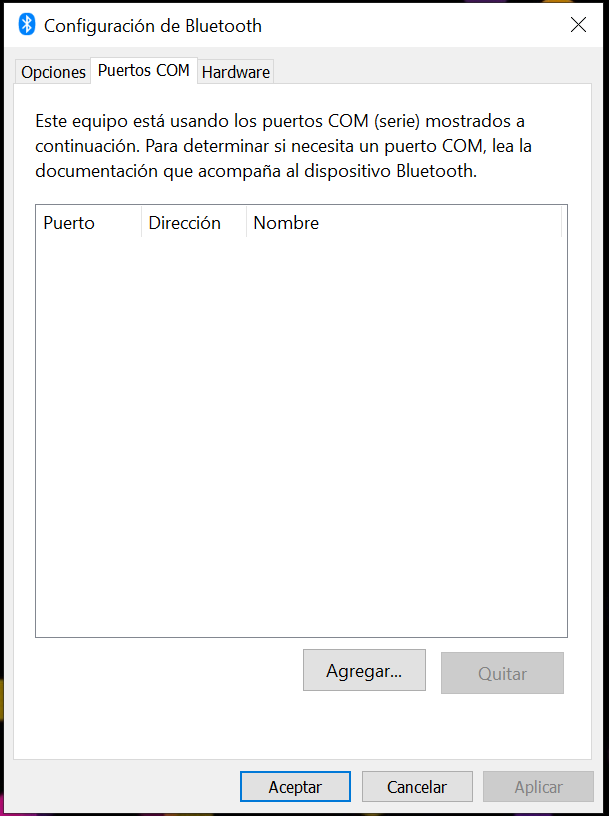

El dato que requerimos para configurar cualquiera de los 2 componentes anteriores se encontrará ahí, en caso de no tener ningún puerto, será necesario crear uno de tipo entrante.   

Realizando todo lo anterior será posible realizar la conexión, recepción y transmisión con otro dispositivo.

#### Aplicación Android

Se hizo uso de MIT App Inventor para la creación de la aplicación con la que se comunicará nuestro sistema. El proceso de creación consiste en una sección para el diseño de la interfaz y otra sección para la lógica de programación.

La interfaz con todos los componentes disponibles se muestra a continuación (aunque no todos serán visibles desde el comienzo):

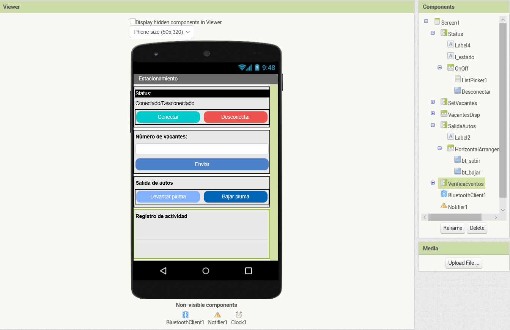

El área de programación se realiza a través de bloques, el primer paso que se realizó fue declarar e inicializar las variables que utilizará la aplicación.

  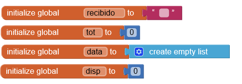

Después se indicó lo que ocurrirá cuando se inicializa la pantalla,lo cual consiste en ocultar algunos componentes y enviar un mensaje en caso de que el bluetooth se encuentre apagado.

  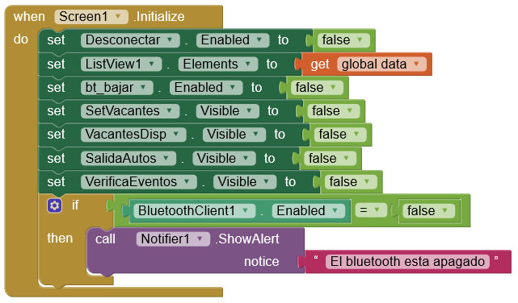

Con el componente ListPicker es posible desplegar una lista, una vez que se oprima. Sin embargo, primero se le debe indicar que elementos va a desplegar de la siguiente forma:

  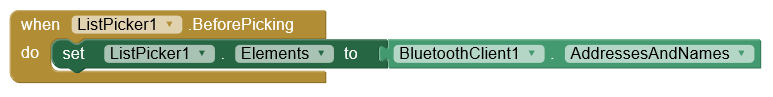

Con lo anterior se indicó que al presionar el botón se mostrarán todos los dispositivos emparejados. Ahora se debe definir que es lo que va a ocurrir cuando se seleccione alguno, que consistirá en tratar de realizar la conexión y en caso de ser exitosa, colocar el status como conectado y hacer visibles determinados componentes.

  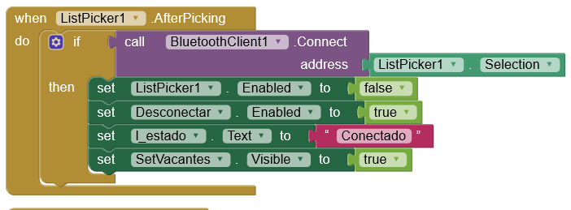

Como se mencionó anteriormente el número total de vacantes que tendrá el estacionamiento, será enviado desde la aplicación. El dato debe ser introducido en la caja de texto y al presionar el botón enviar: será transmitido al sistema, además de realizar las operaciones correspondientes en la aplicación para el despliegue de datos y actualización tanto de vistas como de variables.

  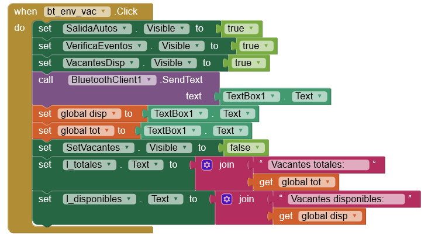

Otra de las tareas importantes de la aplicación consiste en registrar la entrada y salida autos, por lo que la aplicación debe estar a la escucha de nueva información.Y una vez recibida proceder a añadir el evento en la lista de *Registro de actividad* con la hora y fecha en que ocurrió, además de realizar la actualización de vistas y variables.

  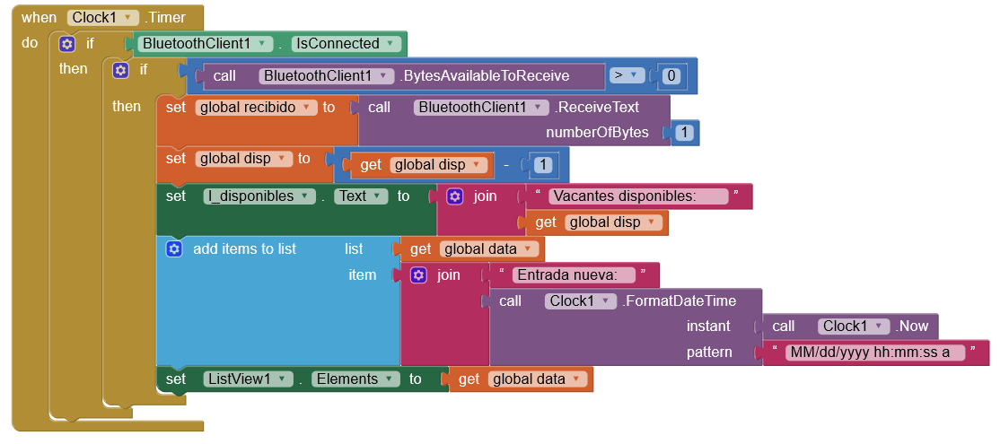

También es posible subir y bajar la pluma del estacionamiento, enviando una señal desde la aplicación. Los botones subir y bajar son mutuamente excluyentes (únicamente uno de los 2 puede estar habilitado a la vez).

El funcionamiento para cuando estos botones son presionados es similar, ambos envían ya sea 1 o 0. La diferencia radica cuando se presiona bajar ya que se aumentan las vacantes_disponibles y se registra el evento de salida. Ambas secciones se muestran a continuación:

  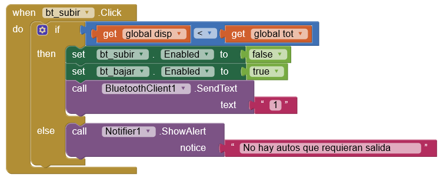

  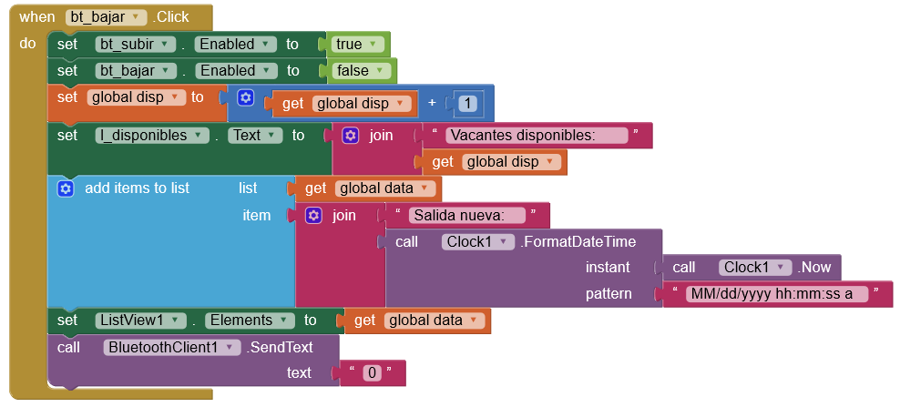

Finalmente para desconectar el sistema de la aplicación se hace uso del botón desconectar, que cierra la conexión y oculta algunas vistas.

  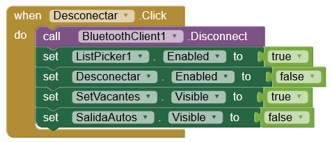

### Análisis de resultados

### Conclusiones
